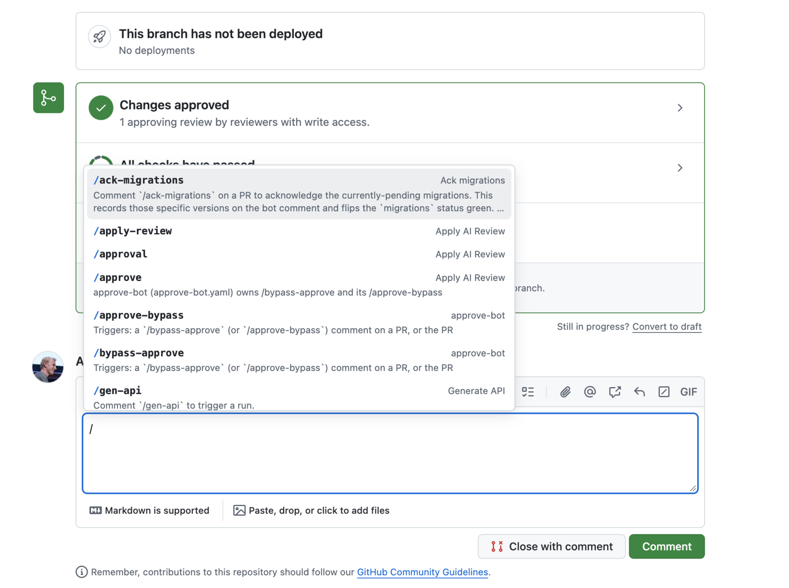

# GitHub slash command autocomplete

A Chrome extension that autocompletes the `/commands` a repository's GitHub Actions
workflows respond to, in pull request and issue comment boxes. Type `/` at the start
of a line and pick from the list.



It reads `.github/workflows/*.yml` through your github.com session, so private repos
work with no token, and finds commands in:

- `if:` expressions such as `startsWith(github.event.comment.body, '/gen-api')`,
  `contains(...)` and `== '/ack-migrations'`, ignoring negated `!contains(...)` checks
- `actions/github-script` snippets such as `body.startsWith('/rerun')`
- shell steps that switch on `$COMMENT_BODY`
- `peter-evans/slash-command-dispatch` `commands:` lists

Each entry shows the workflow name and the comment line in the workflow that
describes the command, when there is one.

## Install

There is no build step and nothing to install from a store. Get the files, then load
them into Chrome as an unpacked extension.

**1. Get the files**

Either clone:

```bash
git clone https://github.com/lawrencejones/gh-slash-commands.git
```

or download the ZIP from the green **Code** button on
https://github.com/lawrencejones/gh-slash-commands and unzip it somewhere permanent.
Chrome loads the extension from that folder every time it starts, so don't delete or
move it afterwards.

**2. Load it into Chrome**

1. Open `chrome://extensions` in a new tab.
2. Turn on **Developer mode** (toggle in the top right).
3. Click **Load unpacked** and choose the `gh-slash-commands` folder (the one that
   contains `manifest.json`).

Works the same in Arc, Brave, Edge and other Chromium browsers; the extensions page
is `arc://extensions`, `brave://extensions` or `edge://extensions`.

**3. Try it**

Open any pull request on github.com and type `/` at the start of a line in the
comment box. The first `/` in a repository takes a second while the workflows load;
after that it's instant.

**Updating**

Pull the latest changes (or download a fresh ZIP over the same folder), then open
`chrome://extensions` and click the reload icon on the extension's card.

**Options**

Commands are cached per repository for six hours. The options page (right-click the
extension icon, **Options**) lets you clear the cache, change the interval, or add a
GitHub token as a fallback for when the same-origin routes stop working.

## Keys

| Key            | Action                          |
| -------------- | ------------------------------- |
| `↑` / `↓`      | Move                            |
| `Enter`, `Tab` | Insert the highlighted command  |
| `Esc`          | Close                           |

GitHub's own `/` menu (code block, table, ...) is hidden while this popup has
matches and comes back when it closes.

## Develop

```bash
node --test test/
```

The last test runs the parser over a sibling `../core/.github/workflows` checkout if
one exists; point `WORKFLOWS_DIR` at another directory to try a different repo.

Layout:

- `parser.js` – pure text extraction, shared by the extension and the tests
- `fetcher.js` – lists and downloads workflow files, caches results in `chrome.storage`
- `content.js` / `content.css` – the popup
- `options.*` – token, cache interval, cache viewer
- `icon.svg`, `icon-small.svg` – icon sources; the small variant has heavier shapes for 16
  and 32px. Regenerate `icons/` with `rsvg-convert` (`brew install librsvg`):

  ```bash
  for s in 48 128; do rsvg-convert -w $s -h $s icon.svg -o icons/icon-$s.png; done
  for s in 16 32; do rsvg-convert -w $s -h $s icon-small.svg -o icons/icon-$s.png; done
  ```
